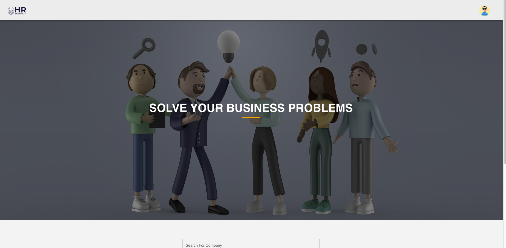
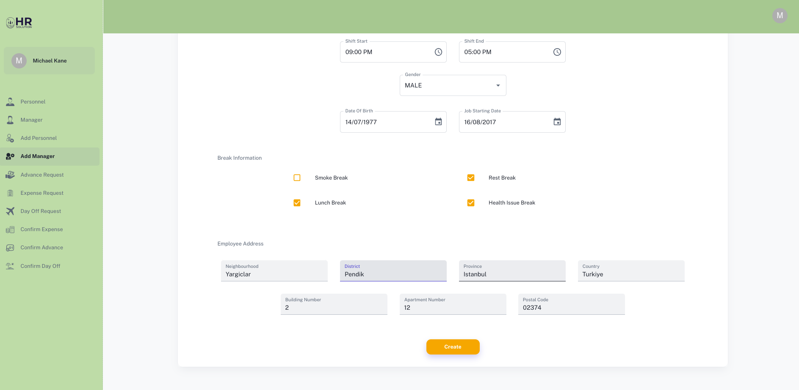

#   <u>HR Management</u>

---
#   <u>Description</u>

HR Management is a website in which gives its users freedom to manage their business easily. If companies
want to use this program, they must forward their company information to the personnel with the admin role, and through these personnel, the companies are registered on the site.
This website gives companies the option to manage their business easily and also advertise their companies.

This website will mainly consist of two main parts those are:
    
*   Visitor
*   Business

### <u>Visitor</u>

Visitors can see the companies which are registered on the website and inspect the detailed information about them also comment's made by personnel who work at the companies
can be seen on these detail pages for each company, and it'll supply trust between the company and the public.

### <u>Business</u>

At the business part, it supplies solutions to the companies about management of the personnel requests. 
All the personnel information will be included on the personnel and manager pages. Personnel can have many request
options such as; advance, expense and day-off from their panels and also can inspect their information and Manager can do all
those utility functions and can respond the personnel requests on their own panel.

#### Register yaptıktan sonra maile activate status kodunuz gelir,bu kod ile hesabınızı aktif edebilirsiniz.

#### DELETE

#### Username ve password ile giriş yapıyoruz.

#### Mailimize gelen aktivasyon kodu ile hesabımızı aktif ediyoruz.

#### UPDATE

#### DELETE

#### DELETE

#### DELETE

#### DELETE

#### DELETE

#### DELETE

#### DELETE

#### DELETE

#### DELETE

#### DELETE

#### DELETE

#### DELETE

#### DELETE

#### DELETE

#### DELETE

#### DELETE

#### DELETE

#### DELETE

#### DELETE

#### DELETE

#### DELETE

#### DELETE

#### DELETE